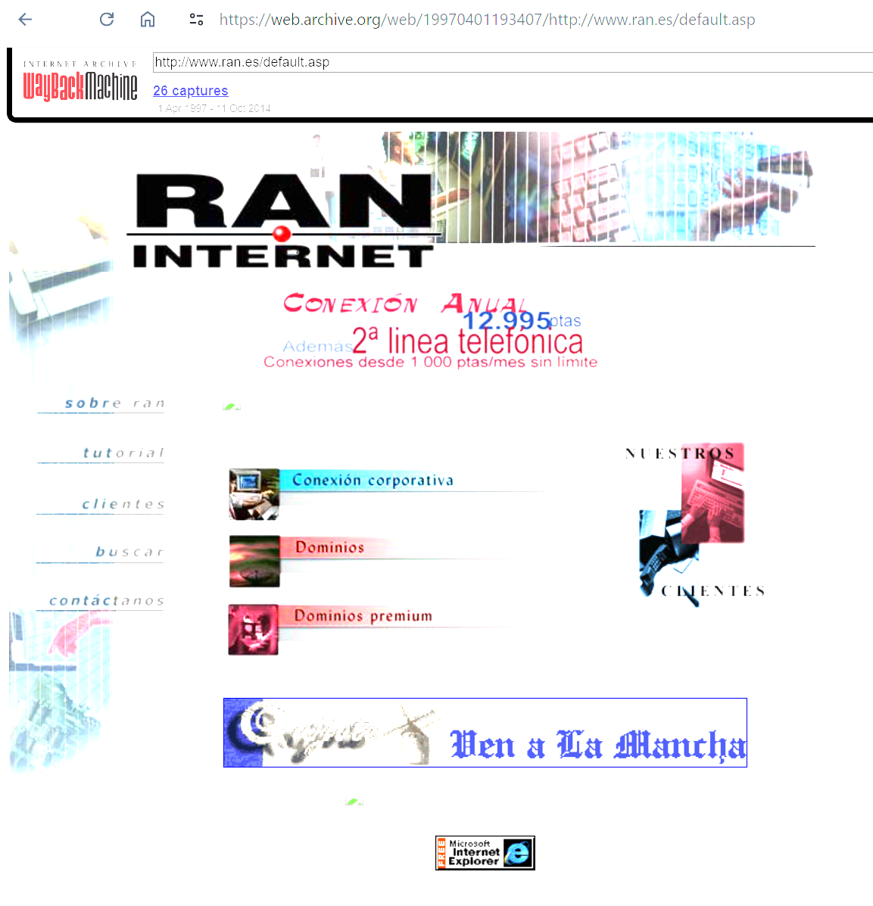

## Hi World 🪐

In 1996, I started professionally with "The Internet."
It was when I created one of the first Internet Providers in Spain, and suddenly, we started offering a new technology called the World Wide Web (WWWW) done with HTML.
Here is my first web page (and some of the earliest web pages done for a company); at this time, Perl was almost the only option available.

[April 1996](https://web.archive.org/web/19970401193407/http://www.ran.es/default.asp)

A long road since then:
- I had to buy CDs with the Slackware Linux Distribution and its source code
- Compile a Linux server when it was only kernel 0.96
- Fight with kernel drivers in C to run serial multi-port cards for attaching our modems with the amazing speed of 28800 bauds (we were the fastest in the market!)
- run all SMTP, NTP, DNS, HTTP servers in local Linux servers, Windows NT Servers
- a router with our dedicated X.25 direct line from Madrid to Paris to connect to "the Internet" (Hi RIPE)

Later, a lot of stuff evolved at light and warp speeds

Lots of new programming languages, data centers, Linux servers, Windows servers, NAS, SAN, Firewalls, Databases, web servers, application servers, and routers.

Virtualization, CLOUD architectures (started cloud with AWS in 1996), more development methodologies, more microservices, dockers, Kubernetes, agile methodologies, and new open source projects with more amazing tools every time.

I am always enjoying it as my first time when I started programming Basic in a glorious Sinclair ZX81; now, I keep learning and being amazed by all new trends, products, and solutions in the market.

# 😃

